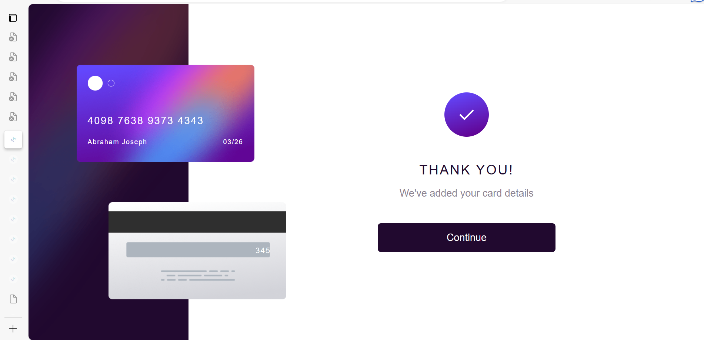
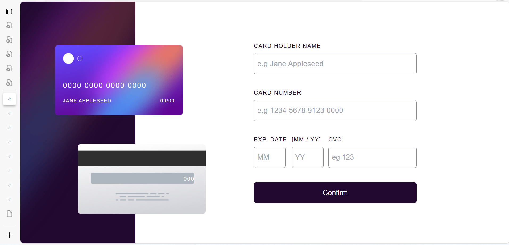
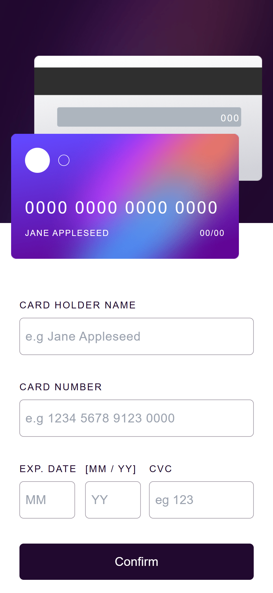

# Frontend Mentor - Interactive card details form solution

This is a solution to the [Interactive card details form challenge on Frontend Mentor](https://www.frontendmentor.io/challenges/interactive-card-details-form-XpS8cKZDWw). Frontend Mentor challenges help you improve your coding skills by building realistic projects.

## Table of contents

- [Overview](#overview)
  - [The challenge](#the-challenge)
  - [Screenshot](#screenshot)
  - [Links](#links)
- [My process](#my-process)
  - [Built with](#built-with)
  - [What I learned](#what-i-learned)
  - [Continued development](#continued-development)
- [Author](#author)

## Overview

### The challenge

Users should be able to:

- Fill in the form and see the card details update in real-time
- Receive error messages when the form is submitted if:
  - Any input field is empty
  - The card number, expiry date, or CVC fields are in the wrong format
- View the optimal layout depending on their device's screen size
- See hover, active, and focus states for interactive elements on the page

### Screenshot

!
!
!

### Links

- Live Site URL: [live site](https://your-live-site-url.com)

## My process

### Built with

- Semantic HTML5 markup
- CSS custom properties
- Flexbox
- Mobile-first workflow
- Vanilla Javascript
- [Styled Components](https://www.tailwindcss.com/) - For styles

### What I learned

The positioning of the cards were quite difficult at first but I figured my way around it. I observed that when a parent element is set to relative, it's child set to absolute and the grandchild to absolute as well, the grandChild will not be absolute to the parent but instead the child.

code snippets, see below:

```html
<div class="parent">
  <div class="child">
    <div class="grandChild"></div>
  </div>
</div>
```

```css
.parent {
  position: relative;
}
.child {
  position: absolute;
}
.grandChild {
  position: absolute;
}
```

The grandchild will be positioned absolutely to the child and not the parent!

### Continued development

I will work on improving my animation skills.

## Author

- Frontend Mentor - [abteck](https://www.frontendmentor.io/profile/abteck)
- Twitter - [@abteck2](https://www.twitter.com/abteck2)
